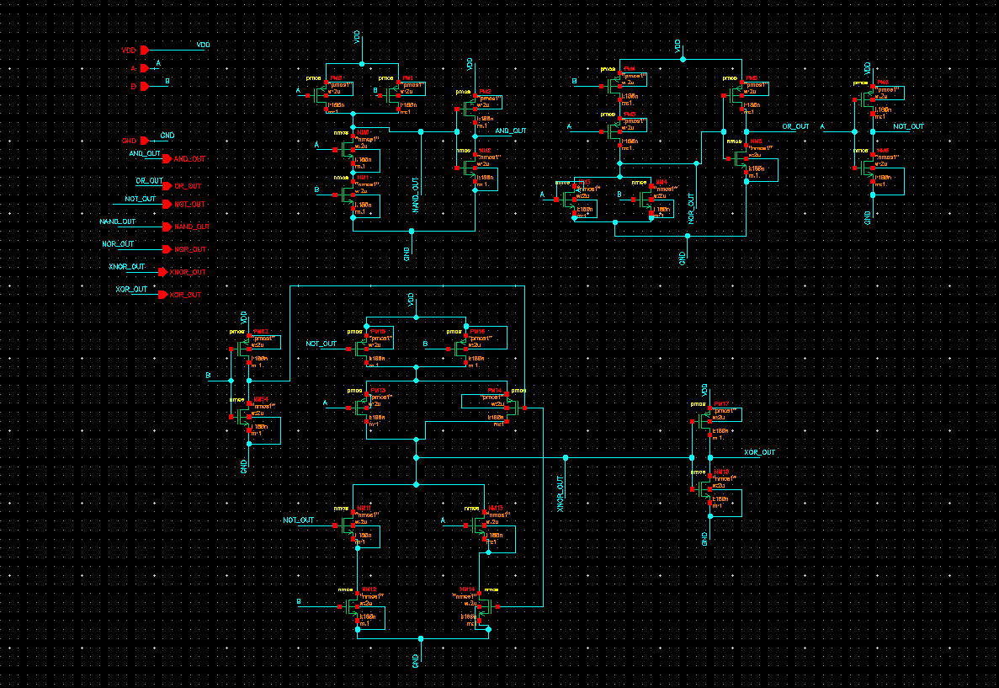
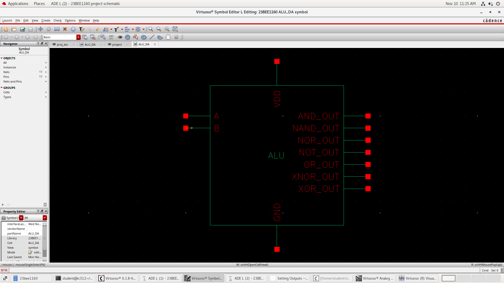
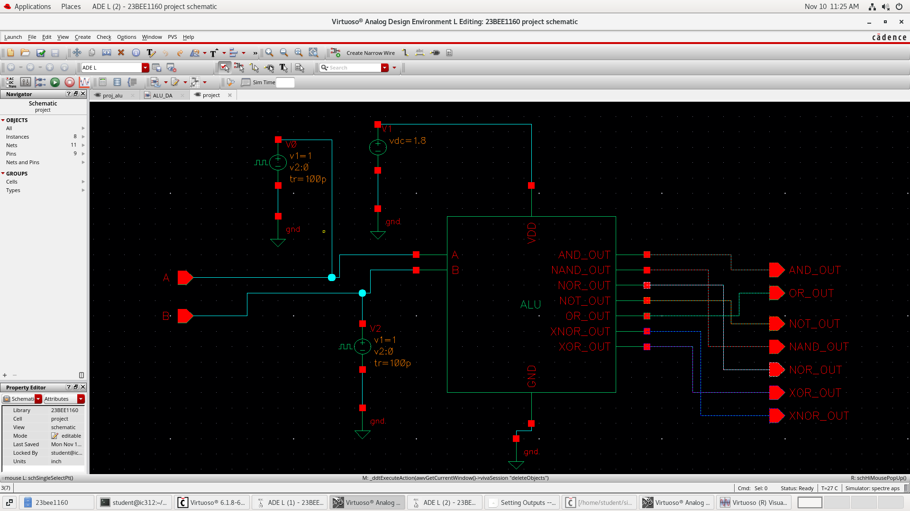
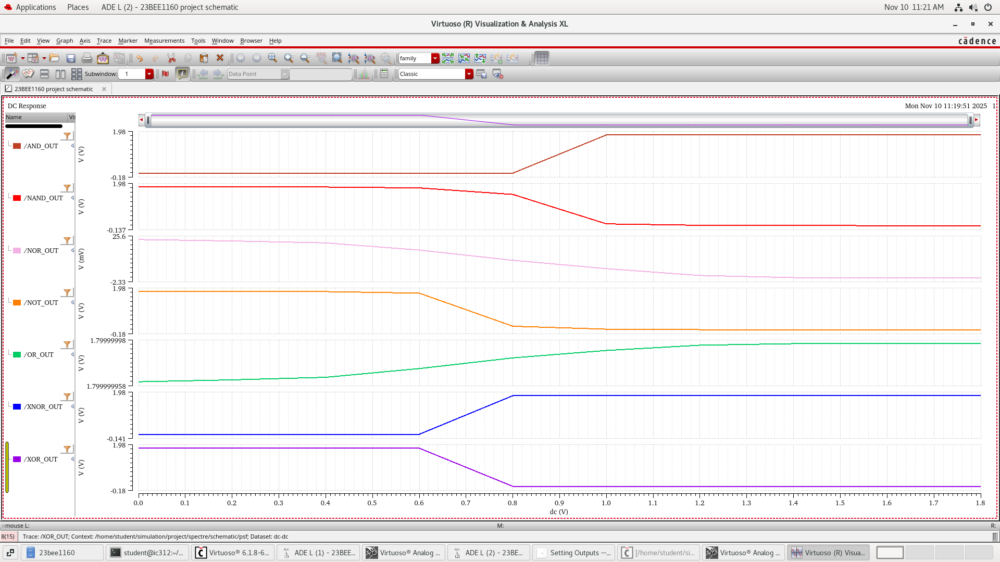
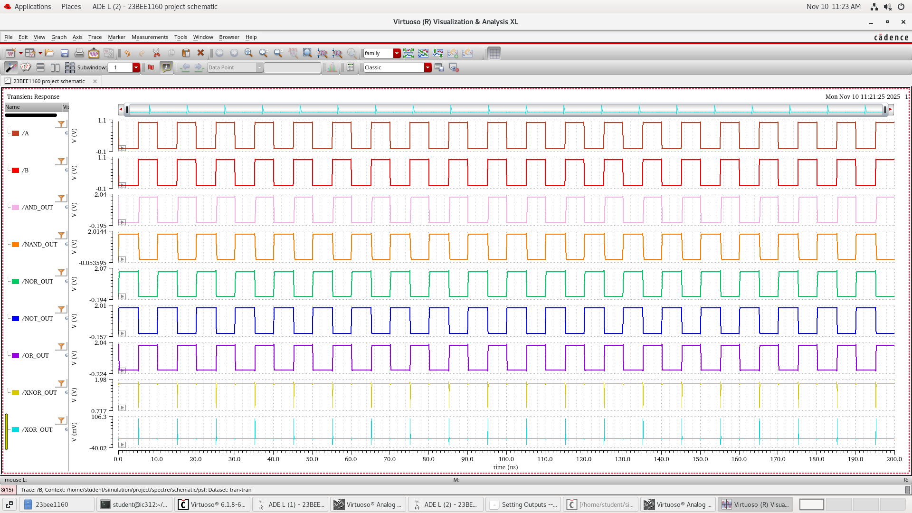

# Layout Design of 2-BIT CMOS ALU Using Cadence Virtuoso
## OBJECTIVE:
To design and simulate a two-input Arithmetic Logic Unit (ALU) performing basic logic operations (AND, OR, NOT, NAND, NOR, XOR, XNOR) using CMOS logic gates in Cadence Virtuoso and design the layout diagram for the same.
## INTRODUCTION:
An essential component of any digital processor is an Arithmetic Logic Unit (ALU). It manipulates binary data using arithmetic and logic.
This project uses CMOS logic to design the ALU at the transistor level. This technology is highly recommended because of its high noise margin, scalability, and low power consumption.
This design includes:
• Basic logic gate realization (AND, OR, NOT, NAND, NOR, XOR, XNOR)
• Symbol creation for the ALU block
• Transient and DC analysis for functional verification
• Layout design
Design Steps
- 1.Schematic Design:
    - Created transistor-level circuits for each logic gate using CMOS structure.
- 2. Symbol Creation:
    - Combined all gates into one ALU symbol with inputs (A, B) and outputs for each gate.
- 3.Testbench Setup:
    - Applied pulse inputs to A and B using voltage sources.
    - Connected VDD = 1.8V and GND.
- 4.DC Analysis:
    - Swept input voltage (0V–1.8V) to observe logic switching points.
- 5. Transient Analysis:
    - Applied pulse waveforms to verify timing and output transitions.
- 6. Layout Design:
    - Generated layout design for the schematic diagram.
    - 
## Truth Table

| A | B | AND | OR | NOT | NAND | NOR | XOR | XNOR |
|---|---|-----|----|-----|------|-----|-----|------|
| 0 | 0 |  0  |  0 |  1  |  1   |  1  |  0  |  1   |
| 0 | 1 |  0  |  1 |  1  |  1   |  1  |  1  |  0   |
| 1 | 0 |  0  |  1 |  0  |  1   |  1  |  1  |  0   |
| 1 | 1 |  1  |  1 |  0  |  0   |  0  |  0  |  1   |

## SCHEMATIC

## SYMBOL

## SETUP

## DC ANALYSIS

## TRANSIENT ANALYSIS

## LAYOUT DESIGN

## Performance Summary
• Supply Voltage (VDD): 1.8V
• Rise/Fall Time: 100ps
• Time period: 10ns
• Static Power: Very Low
• Technology: CMOS

## Conclusion: The logic circuit was successfully simulated and functionally verified. All basic gates AND, OR, NAND, NOR, NOT, XOR, and XNOR produced outputs consistent with the expected truth tables, confirming the functional behaviour and reliable operation of the circuit.
